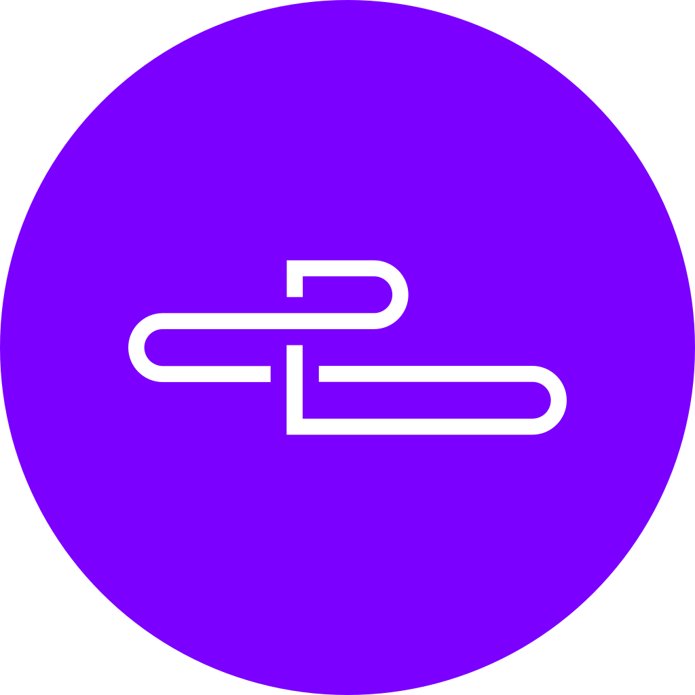

# Hello, I'm Slava 👋 

  

Certified DevOps Engineer who is passionate about DevOps, SRE and Cloud!

## Welcome To My Profile 😄

- I've been honing my DevOps skills and exploring related technologies for about 4+ years. I'm passionate about DevOps culture and its adjacent technologies.
- I started as a novice, but through perseverance and dedication, I've made significant progress in DevOps and operations.
- In additon, over the past years, I've delved into web development.
- I'm actively applying my knowledge through various projects which range from creating and maintaining CI/CD pipelines to maintain and provision infrastructure and its resources.
- Feel free to explore my pinned projects below and browse through my repositories to see more of my work. Please keep in mind that majority of my current work is private and owned by the company I work for.
- If you share similar interests or have any questions, let's connect and collaborate!

<!--
Here are some ideas to get you started:

- 🔭 I’m currently working on ...
- 🌱 I’m currently learning ...
- 👯 I’m looking to collaborate on ...
- 🤔 I’m looking for help with ...
- 💬 Ask me about ...
- 📫 How to reach me: ...
- 😄 Pronouns: ...
- ⚡ Fun fact: ...
-->

## Languages:

  
  
  
  
  
  <!--
  
  
  -->
  

## Technologies and Tools:

  
  
  
  
  
  
  
  
  
  
  
  
  

## Development Tools:

  
  
  

